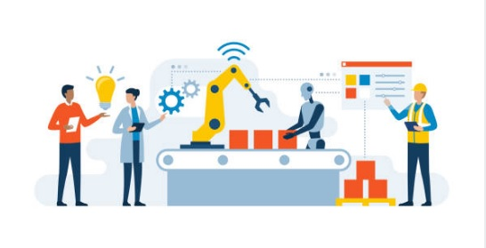

  

<h1>
  Hola soy Enrique. ¡Bienvenido a mi espacio!
  
</h1>

---
 

### 👨‍💻 Sobre mí

Ingeniero electromecánico con más de 15 años de experiencia en **sistemas de manufactura automatizada**, actualmente ampliando mi perfil hacia el **análisis de datos** y la **inteligencia artificial aplicada a la industria**.

- 🏭 He liderado proyectos de **automatización, robótica y mejora de procesos** en entornos industriales exigentes.
- 📊 En proceso de consolidar mis habilidades en **Python, SQL, Tableau y análisis estadístico** para tomar mejores decisiones basadas en datos.
- 🧠 Me apasiona conectar la ingeniería con el **machine learning** y la **gestión de datos** para optimizar la eficiencia productiva.
- ⚙️ Amante de las tecnologías que impulsan la **Industria 4.0**: sensores inteligentes, visualización de datos, integración de sistemas.
- 🤝 Siempre abierto a colaborar en proyectos donde converjan la **experiencia técnica y el análisis de datos**.

---

📬 **Conectemos:**  

<!--
## Hi there 👋
**ENRIQUESLGFP7/ENRIQUESLGFP7** is a ✨ _special_ ✨ repository because its `README.md` (this file) appears on your GitHub profile.
Here are some ideas to get you started:
- 🔭 I’m currently working on ...
- 🌱 I’m currently learning ...
- 👯 I’m looking to collaborate on ...
- 🤔 I’m looking for help with ...
- 💬 Ask me about ...
- 📫 How to reach me: ...
- 😄 Pronouns: ...
- ⚡ Fun fact: ...
-->
